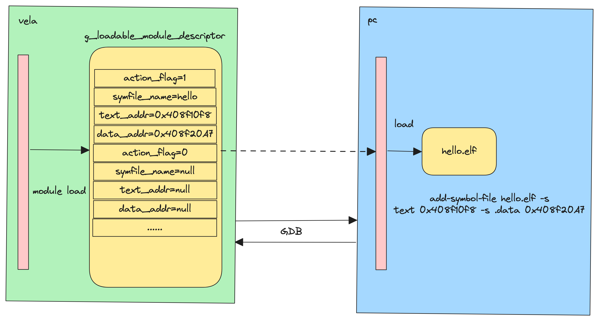

====================
ELF Debug
====================

Overview
========

How to use
-----------

1. Enable NuttX ELF Debug

Enable Kconfig

    .. code-block:: console

      CONFIG_ELF=y                              /* Enable ELF */

      CONFIG_LOADABLE_MODULE_DEBUG=y            /* Enable Load ELF Module in debug mode */

      CONFIG_LOADABLE_MODULE_DESCRIPTOR_COUNT=4 /* Set g_loadable_module_descriptor array size is four */

2. Debugging ELF in Qemu environment on pc

Save ELF Debug file in PC path

    .. code-block:: console

      $ mkdir -p ~/elfs    /* Create a directory to store elf files with debugging information */

      $ cp xxx.elf ~/elfs  /* Copy the elf file compiled by nuttx with debugging information to the elfs directory */

Start qemue emulator in terminal 1

    .. code-block:: console

      $./emulator.sh vela -qemu -S -s /* Start qemue emulator on debug mode */

Start nuttx by GDB in terminal 2

    .. code-block:: console

      $./prebuilts/gcc/linux/arm/bin/arm-none-eabi-gdb nuttx/nuttx  /* Start nuttx by gdb */

      $(gdb) source /xxx/load_elf.py      /* Load python script and excute python init function */

      $(gdb) target remote localhost:1234 /* Connect to the gdb server started by qemu */

      $(gdb) c                            /* continuing */

Excute ELF in terminal 1

    .. code-block:: console

      $ elf                               /* Excute ELF file on ap terminal */

Start debug ELF by GDB

    .. code-block:: console

      $ b hello.c:main                    /* Debugging ELF by GDB in terminal 2 */

(NOTE: For the overall debugging process, please refer to image/elfdebug-gdb-flow_chat.png)

    .. image:: image/elfdebug-gdb-flow_chat.png